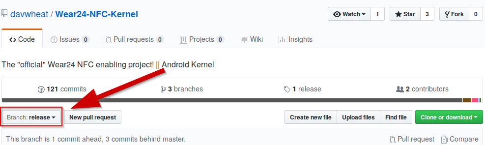

# Wear24 NFC ROM from AOSP

**THIS REPO IS STILL VERY VERY UNDER CONSTRUCTION**

[](https://travis-ci.org/davwheat/Wear24-NFC-Kernel)

This project is a modified mirror of Google's AOSP specifically targetted at the Quanta `dorado` (sold as the Verizon Wear24) to pair with our custom NFC kernel. Our aim is to get the watch to support NFC, a feature Verizon promised, yet never shipped. In the future, greater modifications may be made to support more features or update to newer systems such as Oreo or "H".

## Discord

https://discord.gg/8XyTeUC

## Branches

**This section has NOT been updated to suit this repository.**



PLEASE CHECK WHICH BRANCH YOU ARE ON BEFORE BUILDING!

This repository has three main branches: `master`, `nfc` and `release`. These branches are semi-equivalent to Google Chrome's Stable, Beta and Dev update channels.

`master` is *normally* stable. We generally don't push changes here unless we are confident that they work. We don't recommend flashing your device using this code despite us calling it 'stable'.

`nfc` is unstable and experimental. Likely broken half the time. **DO NOT FLASH FROM HERE UNLESS YOU WANT TO** (probably) **BRICK YOUR DEVICE!**

`release` is our end user branch. This is where we will distribute the ROM when there is an actual reason to flash it. Our releases are automagically built by our [Travis CI integration](https://travis-ci.org/davwheat/Wear24-NFC-ROM/branches) and uploaded to [GitHub releases](https://github.com/davwheat/Wear24-NFC-ROM/releases).

## Contributing


### Cloning

Due to high file sizes, it is recommended to only clone the whole repository if necessary. If you do plan on doing so, **use SSH and NOT HTTP**.

To do so...
1. Open the terminal
2. Paste the following code, substituting your GitHub email: `ssh-keygen -t rsa -b 4096 -C "your_email@example.com"`
3. When asked to choose the file location, press `ENTER` (accept the default location)
4. Enter a secure passphrase (which you'll remember!)
5. Start the `ssh-agent` (enter `eval "$(ssh-agent -s)"` into the console)
6. Add your SSH key to `ssh-agent` (type `ssh-add ~/.ssh/id_rsa` and enter your passphrase when asked)
7. [Add the SSH key to your GitHub account](https://help.github.com/en/articles/adding-a-new-ssh-key-to-your-github-account)
8. After, just clone the repo using `git clone --recursive git@github.com:quantify-nfc/Wear24-NFC-ROM-AOSP`

### Pushing

If you are planning on pushing large changes, it is recommended to change the following git config values:

```
git config core.bigFileThreshold 15m
git config --global http.postBuffer 157286400
```

### Meanings

|Config value|Description|Benefit|
|---|---|---|
|`core.bigFileThreshold 15m`|Disables delta compression on files larger than 15 MB|Vastly reduces `git push` time|
|`http.postBuffer 157286400`|Increases the Git buffer size to the largest file in the repo|Decreases failed `push` attempts|

## Building

**This section has NOT been updated to suit this repository.**

`android-tools-fsutils` is needed for `make_ext4fs`!

`sudo apt install android-tools-fsutils`

### Automatic

**This section has NOT been updated to suit this repository.**

Extract the existing `system.img`, add our own files, and rebuild using `./build.sh`.

### Manual

**This section has NOT been updated to suit this repository.**

**NOT RECOMMENDED**

*Coming soon*


